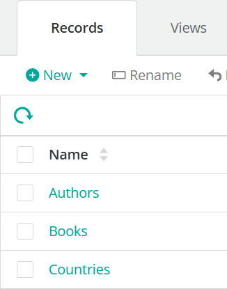
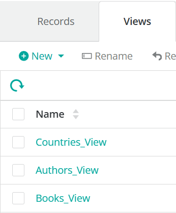

# Настройка IDE и установка BMC Helix Innovation Studio SDK
📚 Документация базируется на следующих ресурсах:

1. [Setting up your IDE and installing BMC Helix Innovation Studio SDK](https://docs.bmc.com/xwiki/bin/view/Service-Management/Innovation-Suite/BMC-Helix-Innovation-Suite/is233/Developing-applications-by-using-BMC-Helix-Innovation-Studio/Developing-and-deploying-code-based-applications/Setting-up-the-environment-to-develop-a-code-based-application/Setting-up-your-IDE-and-installing-BMC-Helix-Innovation-Studio-SDK/)

2. [Creating a Project using Maven and the Archetype](https://docs.bmc.com/xwiki/bin/view/Service-Management/Innovation-Suite/BMC-Helix-Innovation-Suite/is233/Developing-applications-by-using-BMC-Helix-Innovation-Studio/Developing-and-deploying-code-based-applications/Setting-up-the-environment-to-develop-a-code-based-application/Creating-a-Project-using-Maven-and-the-Archetype/)

3. [Deploying your application for the first time to start working in BMC Helix Innovation Studio](https://docs.bmc.com/xwiki/bin/view/Service-Management/Innovation-Suite/BMC-Helix-Innovation-Suite/is233/Developing-applications-by-using-BMC-Helix-Innovation-Studio/Developing-and-deploying-code-based-applications/Setting-up-the-environment-to-develop-a-code-based-application/Deploying-your-application-for-the-first-time-to-start-working-in-BMC-Helix-Innovation-Studio/)

3. [Vendor examples Github](https://github.com/bmchelix/innovation-studio-developer/tree/main/23.3.02/test210500/)


---

## 🔧 Что понадобится

- Доступ к **BMC Helix Innovation Studio Sandbox** (песочница)
- Права администратора на машине (Windows / macOS / Linux)

💡 Рекомендуемые браузеры: **Google Chrome** или **Mozilla Firefox**

---

## 📦 Компоненты окружения

| Компонент | Версия | Назначение |
|-----------|---------|------------|
| Java JDK  | 17.0.8.1+1 | Обязательная версия для SDK |
| Maven     | 3.9.8 | Управление зависимостями и сборкой |
| Eclipse IDE | 2024-06 + AJDT | Среда разработки |
| Git       | GitHub Desktop или Portable Git | Система контроля версий |
| Node.js   | 16.20.1 | Frontend-сборка |
| Yarn      | 1.22.19 | Пакетный менеджер |
| Grunt CLI | 1.3.2 | Сборка UI-компонентов |
| RX_SDK_HOME | com.bmc.arsys.rx.sdk-23.3.02 | Переменная окружения для SDK |

---

## 🚀 Установка и настройка шаг‑за‑шагом

### 1. Установите OpenJDK 17.0.8.1+1

1. Скачайте архив OpenJDK для вашей системы:
   - [⬇️ Windows (.zip)](https://github.com/adoptium/temurin17-binaries/releases/download/jdk-17.0.8.1%2B1/OpenJDK17U-jdk_x64_windows_hotspot_17.0.8.1_1.zip)
   - [⬇️ Linux / macOS (.tar.gz)](https://github.com/adoptium/temurin17-binaries/releases/download/jdk-17.0.8.1%2B1/OpenJDK17U-jdk_x64_mac_hotspot_17.0.8.1_1.tar.gz)
2. Распакуйте, например в `C:\Tools\Java\jdk-17.0.8.1+1\`
3. Создайте переменную окружения `JAVA_HOME` → путь к каталогу JDK
4. Добавьте `%JAVA_HOME%\bin` в `PATH`

⚠️ Уберите из `PATH` ссылки на старые JRE (например, `C:\Program Files\Java\jre\bin`).

---

### 2. Установите Maven 3.9.8

1. Скачайте архив (`apache-maven-3.9.8-bin.zip` или `.tar.gz`) и распакуйте
   - [⬇️ Maven](https://archive.apache.org/dist/maven/maven-3/3.9.8/binaries/)
2. Создайте переменную `MAVEN_OPTS`:
   ```bash
   -Xms512m -Xmx1024m
   ```

💡 Если сборка падает из‑за HTTP‑блокировки, настройте `settings.xml`:
```xml
<mirrors>
  <mirror>
    <id>central-over-https</id>
    <mirrorOf>central</mirrorOf>
    <name>Maven Central Repository</name>
    <url>https://repo.maven.apache.org/maven2</url>
  </mirror>
</mirrors>
```

---

### 3. Установите Git

- Установите приложение
- Добавьте путь к `git.exe` в `Path`
- Проверьте:
  ```bash
  git --version
  ```
---

### 4. Установите Node.js 16.20.1

Проверьте текущую версию:
```bash
node --version
```

Если ниже — удалите и установите через **nvm**:
```bash
nvm install 16.20.1
nvm use 16.20.1
```

---

### 5. Установите Yarn 1.22.19

```bash
npm install -g yarn@1.22.19
```

Проверьте:
```bash
yarn --version   # должно быть 1.22.19
```

---

### 6. Установите Grunt CLI 1.3.2

```bash
npm install -g grunt-cli@1.3.2
```

Если команда `grunt` не находится — добавьте в `PATH` папку:
```
C:\Users\<User>\AppData\Roaming\npm
```

---

### 7. Установите BMC Helix Innovation Studio SDK

1. Скачайте архив **SDK 23.3.02**
2. Распакуйте, например в `C:\sdk`
3. Создайте переменную окружения `RX_SDK_HOME` → каталог SDK (`com.bmc.arsys.rx.sdk-23.3.02`)
4. Соберите зависимости:
   ```bash
   cd C:\sdk\com.bmc.arsys.rx.sdk-23.3.02\lib
   mvn clean install
   ```


---

## ✅ Быстрая проверка окружения

| Команда | Ожидаемый результат | Проверка |
|---------|----------------------|----------|
| `java -version` | `openjdk 17.0.8.1+1` | `JAVA_HOME`, `PATH` указывают на JDK 17 |
| `mvn -version`  | `Maven 3.9.8` + Java 17 | `MAVEN_OPTS` и `PATH` настроены |
| `node --version` | `v16.20.1` | При необходимости переключение через nvm |
| `yarn --version` | `1.22.19` | Путь к Yarn в `PATH` |
| `grunt --version` | `1.3.2` | Папка NPM в `PATH` |
| `echo %RX_SDK_HOME%` | путь к SDK | Указывает на `com.bmc.arsys.rx.sdk-23.3.02` |

---

## 📚 Работа с локальным проектом Demo Library

В каталоге с данным markdown есть папка **demo-library**, её можно локально стянуть из Git-репозитория:

```bash
git clone https://github.com/VolkovDenisS/THA-Helix-Angular.git
```

> ⚠️ Если папка `demo-library` уже существует — убедитесь, что она пуста, либо выполните `git pull` внутри неё для обновления.

### ⚙️ Настройка pom.xml

После клонирования откройте файл `demo-library/pom.xml` и измените значения:

- `developerUserName` — замените на имя учётной записи для доступа к Innovation Studio
- `developerPassword` — замените на пароль от этой учётной записи
- `webUrl` — замените `localhost` на имя хоста или IP адрес инстанса Innovation Studio

### ✅ Проверка конфигурации

Проверить корректность конфигурации можно выполнив команду из папки проекта:

```bash
mvn clean install -Pdeploy -Pexport -X
```

Ожидаемым результатом является успешный деплой.
После чего можно приступать к заданию из 👉 [MAIN.MD](./MAIN.MD)

---
Проект состоит из **3 Records (таблиц)** и **3 Views** для отображения информации.

<p float="left">
  
  
</p>


Для работы с приложением используйте следующие ссылки:

🔗 URL доступа к проекту

http://127.0.0.1:8008/helix/index.html#/com.bmc.arsys.rx.innovationstudio/com.example.demo-library/record-definitions

🏠 URL Home Page с доступом к View

http://127.0.0.1:8008/helix/index.html#/com.example.demo-library/view/com.example.demo-library:Books_View

> ⚠️ Вместо `127.0.0.1` необходимо указать адрес сервера **Innovation Studio**.

---

## 🛠️ Отладка приложения

Для запуска отладки выполните следующие шаги:

1. Перейдите в каталог фронтенда:
   ```bash
   cd C:\sdk\projects\demo-library\bundle\src\main\webapp
2. Выполните команду:
   ```npm start -apihost="127.0.0.1"```

Измените 127.0.0.1 на адрес сервера Innovation Studio

Отладочный сервер будет доступен по адресу

http://localhost:4200/helix/index.html#

---

